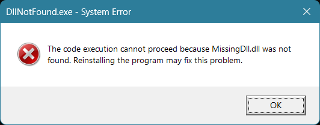
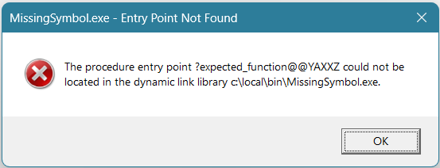
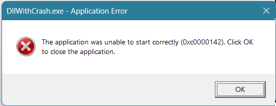
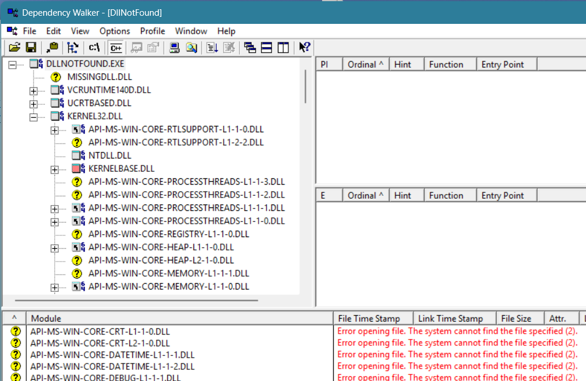
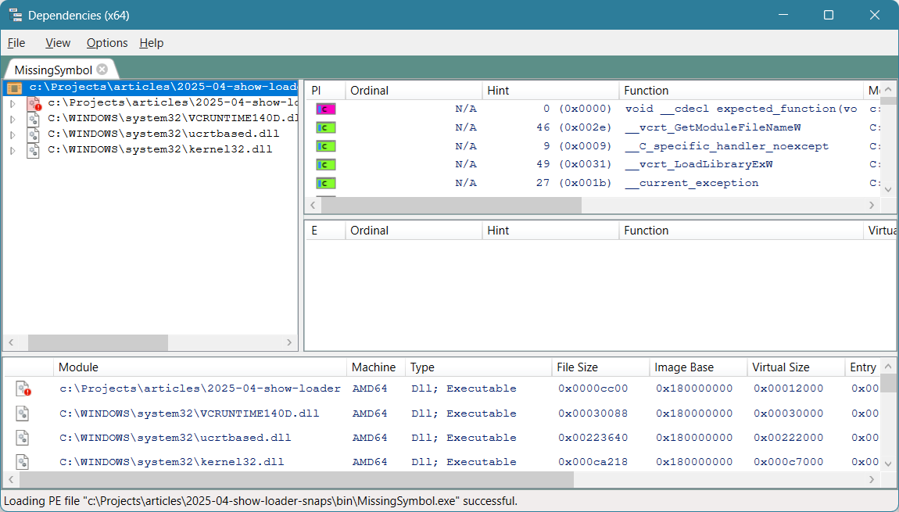
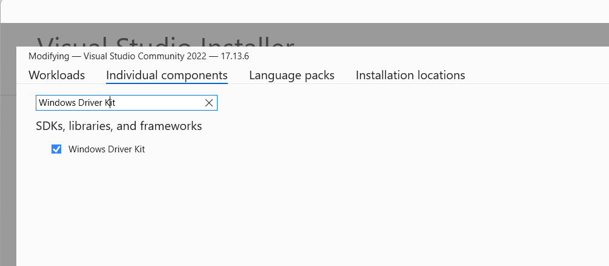
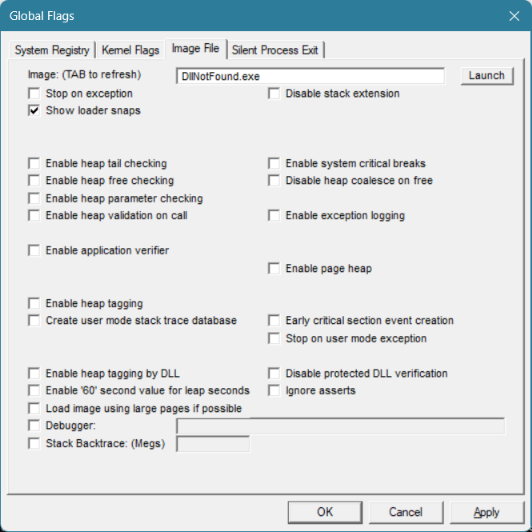
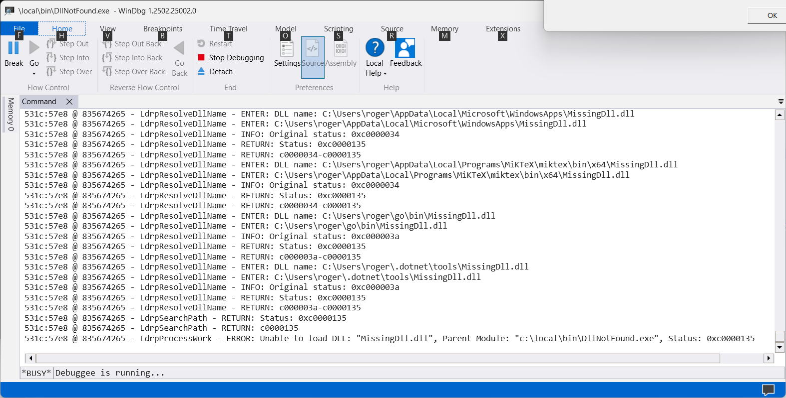

# Debugging Run-time Windows DLL problems #

## Introduction ##

Windows, in common with many other operating systems, supports "late binding" where some or most of the symbols in an executable program are resolved at runtime from other files in the system. On Windows these are known as "Dynamic-Link Libraries" and a brief overview can be found, for example, in &#91;Dynamic-Link Libraries&#93;. The Win32 system itself is accessed via entry points in (numerous) such dynamic link libraries (DLLs) and many applications are shipped as one or more executable programs (EXEs) and supporting DLLs.

While this approach provides a lot of benefits, likely already known to many of the readers of this article, it also adds an additional failure point in the running of the application.

With so-called "static" linking all required symbols are located at link time and the actual code or data is bound into the executable file. The resultant binary is therefore complete in itself and all the code needed at execution time is guaranteed to be present (and the same as that at link time.) Dynamic linking in contrast may fail if one or more of the DLLs needed at runtime cannot be found, cannot be loaded, or do not contain the symbols that are expected. (Additionally, but not otherwise focussed on in this article, there are security issues arising from the way that the code to be executed is located and loaded at runtime - the code executed can be very different from the code the original program linked against.)

The design choice taken for Windows DLLs is that each late binding symbol is tied to a named dynamic library, and this name is in turn tied to the actual filename of the DLL that the loader finds on disk. Note that this is not the only design choice, and Linux for example made a different choice which has a slightly different set of benefits and issues.

## What could possibly go wrong? ##

There are three broad categories of failure when resolving a late binding symbol:
1. The DLL cannot be located
2. The symbol cannot be resolved against the DLL found
3. There is a problem when loading the DLL into the process memory

Additionally, there are two contexts where late binding occurs: one is when the system loader _implicitly_ resolves late binding symbols and the other is under program control when an application can request a DLL to be loaded into the running process and can attempt to resolve symbols in a loaded DLL. This is not a hard separation as these two contexts overlap, when for example an application requests a DLL that itself has late binding symbols or makes use of the Microsoft "delay loading" mechanism (See &#91;Linker support for delay-loading DLLs&#93;.)

There are two main differences between these contexts. Firstly, in the former case any failure is fatal whereas in the latter case the program will receive an error code from the failed call and so some sort of recovery or remediation can be attempted. Secondly, the former case is in principle discoverable statically from the information in the headers of the executable and the DLLs whereas the second case requires an actual program execution as the behaviour is only evidenced at runtime.

These differences also affect the diagnosis when problems occur, as we shall see later on.

Note that _this_ article doesn't cover the process of _building_ DLLs on Windows.

## What does Windows usually report? ##

Often (depending on a variety of factors outside the scope of this article) Windows will produce a simple error dialog when there are problems with the implicit resolution for a late binding symbol. 

The first example is when `DllNotFound.exe` is executed and the dependent DLL `MissingDll.dll` cannot be located:



This dialog does helpfully tell us the name of the DLL that is not found, but I must confess I have very rarely found that this problem can be fixed by reinstalling the program. Your experience may be different!

When under programmatic control, using `LoadLibrary` or `LoadLibraryEx`, the failure is indicated by returning a `NULL` handle to the loaded module and the actual underlying error can be obtained from `GetLastError()`; it is usually 126 which is defined as `ERROR_MOD_NOT_FOUND`.
While often this is enough to identify the problem, we get no information that might help with identifying the DLL that could not be located in the case where it was not the actual library we were trying to load that could not be found, but one of _its_ dependent libraries.

The second example is when the DLL is found, but the required export is not present. For this to occur the DLL found at load time must be different from the DLL that is associated with the library (LIB) file used when the executable was created:



This dialog gives us the so-called "decorated name" (also known as the "mangled name") of the symbol we are loading - see &#91;Decorated names&#93; for more details - but it does _not_ show the name of the DLL in which this symbol was expected to be found. Undecorating (or demangling) the name is easy (although it is probably not actually necessary in this case!) as fortunately we can copy and paste from the dialog using Ctrl+C / Ctrl+V and then run the `undname` program provided with Visual Studio to turn this symbol into the C++ symbol we are looking for:
```
---------------------------
MissingSymbol.exe - Entry Point Not Found
---------------------------
The procedure entry point ?expected_function@@YAXXZ could not be located in the dynamic link library c:\local\bin\MissingSymbol.exe. 
---------------------------
OK   
---------------------------
```

Then `undname ?expected_function@@YAXXZ ` produces: 
```
Undecoration of :- "?expected_function@@YAXXZ"
is :- "void __cdecl expected_function(void)"
```
You can also call the function `UnDecorateSymbolName` from the header `DbgHelp.h` to undecorate names under program control.

Note that the decoration is MSVC specific; other implementors' C and C++ compilers may or may not use the same scheme. Additionally, note that the decoration scheme used by MSVC compilers does gradually change over time to support new features in the language (although we've had a long period of relative stability with no significant changes since VS 2015 and the last (minor) change being in VS 2019 version 16.10.)

The equivalent programmatic mechanism is to call `GetProcAddress`; this takes a module handle from a DLL previously loaded into the process address space and the name of the symbol to be loaded. The failure is indicated by returning `NULL` as the address of the symbol and the actual underlying error can be obtained from `GetLastError()` (as above); it is usually 127 which is defined as `ERROR_PROC_NOT_FOUND`.

Finally, if the DLL fails to _load_ then you are likely to see something like this produced:



This dialog is less useful than the first two since it gives no indication of _which_ initialization routine failed.

The equivalent programmatic error returned from `LoadLibrary` or `LoadLibraryEx` is error code 1114 which is defined as `ERROR_DLL_INIT_FAILED`.
Note that the error code in the dialog box, 0xc0000142, is defined as `STATUS_DLL_INIT_FAILED` in `NtStatus.h` and can be mapped to `ERROR_DLL_INIT_FAILED` via the `RtlNtStatusToDosError` function, defined in the header `winternl.h`.

## "Manual" detective work ##

When one of the three errors occurs we can check things by hand to try and identify the root cause of the failure.

We can look for a missing DLL by searching for the corresponding DLL filename and making sure that it can be found by the loader. However, working out exactly where the loader is going to look can be complex as there are numerous flags and options that change the actual path used by the system to locate DLLs. The full details are listed in &#91;Dynamic-link library search order&#93; which is not an easy read -- there are lots of factors to consider.

Fortunately for many common cases it is enough if the target DLL is in the `system32` (64-bit programs) or `syswow64` (32-bit programs) directory underneath `%SystemRoot%` (typically `C:\Windows`), in the directory of the application executable, or somewhere along the `%PATH%`. (Note: the counterintuitive 64-bit directory name `system32` was retained for backwards compatibility with the original 32-bit Windows NT, even though it now contains 64-bit DLLs. In addition, for extra fun, Windows provides transparent file redirection from `system32` to `syswow64` for 32-bit programs: see &#91;File System Redirector&#93; for more on this. If you find this confusing you are not alone.)

Looking for a missing symbol requires three things: the symbol being _requested_, the _name_ of the DLL expected to provide this symbol, and the list of symbols actually _exported_ from the target DLL. One way to obtain this information is by using the `dumpbin` program that comes with Visual Studio twice, once on the requesting binary and once on the target DLL. 

For the example above of a missing symbol this gives:
```
c:> dumpbin /imports C:\local\bin\MissingSymbol.exe
...

  Section contains the following imports:

    ChangedExports.dll
             14000E000 Import Address Table
             14000E458 Import Name Table
                     0 time date stamp
                     0 Index of first forwarder reference

                           0 ?expected_function@@YAXXZ
...
```

We then need to locate the actual `ChangedExports.dll` that the application tried to load and then run `dumpbin` again, this time with the `/exports` switch to see what symbols the library _offers_:
```
c:> dumpbin /exports C:\local\bin\ChangedExports.dll
...
    ordinal hint RVA      name

          1    0 000010B9 ?renamed_function@@YAXXZ = @ILT+180(?renamed_function@@YAXXZ)


Summary
...
```

Since the list of exported symbols only contains `renamed_function` and not `expected_function` we can immediately see what the problem is.

Finally, the case where the DLL fails to initialize. This can be very hard to identify as there's little that can be done statically to identify _which_ of the potentially large number of dependent DLLs was the one with the failing initialization routine; if you are fortunate the problem is an access violation or an exception that you can find relatively easily using a debugger.

But surely there must be some better ways to do this than this sort of manual investigation?

## Viewing the dependencies ##

### What _not_ to use ###

Many years ago Microsoft used to ship a GUI tool for viewing dependencies, `depends.exe`. This tool was later made freely available from its own website &#91;Dependency Walker&#93;. Unfortunately the website stopped updating at version 2.2 which reports under "What is New in Version 2.2" that it covers "... Updated internal information about known OS versions, build numbers, and flags up to the Vista RC1 build." (The tool's "About" page proudly reports that it was built on 29 Aug 2006!) Microsoft's web site recommends using this tool only on Windows 8 or before. Many people do still try to use this tool, but it has not stood the test of time very well. In particular, recent versions of Windows have added "API Set" functionality which is effectively a way to provide a platform-dependent virtual alias for a real DLL. These 'virtual DLLs' cause various problems for older tools that are completely unaware of their existence, like `depends`, and attempt to process them like normal DLL names.

For example, if I try to run depends.exe 2.2.6000 on Windows 11 to look at the dependencies for `DllNotFound.exe` there are two problems. Firstly it takes over eight minutes to run on my computer (with one thread being 100% busy) and secondly, while it does successfully report that the `MissingDll` is missing, it _also_ reports numerous false positives:



These two problems make it of rather limited use on current versions of Windows especially for programs more complex than this almost trivial example program.

### A potentially better tool  ###

One recommended tool with similar functionality is "Dependencies" available on GitHub at &#91;Dependencies&#93;. However the last commit was back in Nov 2021 so it does not appear to be being maintained any longer.

It does at least _partly_ understand the newer API Set entries in the module headers, and so if I run this tool against `MissingSymbol.exe` it does quickly identify the missing symbol and the DLL containing it:



This works well for "top level" problems that are visible in the default view, which lists direct child DLLs. For more complex applications with many DLLs and deep dependency trees it seems hard to use this view to find the actual problems as you need to manually expand each node in the tree in turn until you find a node showing a problem. This can take quite a while and is a very manual process.
 
There are two other options listed in the Tree Build behaviour dialog accessed from Options -> Properties: "RecursiveOnlyOnDirectImports"  and "Recursive". The first option may help with locating the problem as it does provide a more complete list of DLLs in the lower pane. However, there does not appear to be a way to display errors so you have to scroll through the (potentially rather long) list of DLLs and API Sets looking for a warning icon. The second option does appear to do more work but it consumed **9 GB** of RAM during the process and, like Dependency Walker, consumed **lots** of CPU doing so (it actually used _all_ my cores for about 20 minutes).

So while this tool can be of some help in examining the dependency tree of an application, it does not appear to offer a simple solution to finding problems with the dependencies.

### Other problems with dependency viewing tools ###

Since both tools are performing external analysis of dependencies in the target binary, they suffer from some inevitable issues with analysing problems occurring at runtime and also with problems that are related to the precise path being used to search for dependent DLLs. The older tool, `depends.exe`, did actually offer a way to attempt runtime diagnosis and this could be successfully used back in the pre-Windows 10 days, with some restrictions. The newer tool lists under "Limitations" that: "Dynamic loading via LoadLibrary are not supported (and probably won't ever be)."

## Using the loader itself ##

Fortunately there is a better way to debug loader problems than by analysing the program from the outside. The Microsoft loader itself contains diagnostic code that can be configured to print out information about the loading process _as it occurs_.

This setting goes by the name of "Show Loader Snaps". (I believe the "Snaps" in this phrase refers to the short status messages it produces.) When this setting is enabled for a process the loader will provide extra diagnostic information _to an attached debugger_ for the actions it takes while loading DLLs and resolving symbols; whether implicitly or by calling functions like `LoadLibrary`. The output appears in the debugger in the same way that output from calls to `OutputDebugString` does. However the actual mechanism used in the loader is subtly different from an actual call to `OutputDebugString` and unfortunately, _unlike_ output from `OutputDebugString`, there does not appear to be any way to view the loader snap information using other tools, such as DebugView from SysInternals.

### Enabling "Show Loader Snaps" for a process ###

The official way to use this is to use the `GFlags.exe` program that is part of &#91;Debugging Tools For Windows&#93; - I chose the route of simply asking for `Windows Driver Kit` as an Individual Component as part of my VS 2022 installation.



You then run `gflags.exe` -- which requires Admin rights -- and go to the "Image File" tab. Type the base name of the executable into the entry field and press TAB. You can then enable the flag, and click OK (or Apply).



What this actually does is to write a value to the registry:
```
HKEY_LOCAL_MACHINE\SOFTWARE\Microsoft\Windows NT\CurrentVersion\Image File Execution Options\DllNotFound.exe
    GlobalFlag    REG_DWORD    0x2
```

You can of course write the same value using any other tool of your choice, you are not required to use GFlags.

### Viewing Loader Snaps ###

Now whenever a program named `DllNotFound.exe` is executed under a debugger such as Visual Studio or WinDbg all the loader diagnostic information will appear in the debugger's output window.

For example, here is the result of running `DllNotFound.exe` using WinDbg:



This gives us the information we had in the dialog box we obtained by default at the beginning of this article, and also additional debugging output that may help us with diagnosing more complicated issues. You can for example see in this screenshot the tail end of the complete list of places where the loader searched when trying to locate `MissingDll.dll`.

The same is true for the MissingSymbol.exe case: the output in the debugger contains:
```
4a58:3e34 @ 836003546 - LdrpNameToOrdinal - WARNING: Procedure "?expected_function@@YAXXZ" could not be located in DLL at base 0x00007FFDC3310000.
4a58:3e34 @ 836003546 - LdrpReportError - ERROR: Locating export "?expected_function@@YAXXZ" for DLL "c:\Projects\articles\2025-04-show-loader-snaps\bin\MissingSymbol.exe" failed with status: 0xc0000139.
```

However the output in this case is slightly less immediately readable as there are fifty or so _additional_ `INFO` lines logged after these two, making it a little more difficult to identify the relevant output.
The "Show Loader Snaps" approach _also_ provides useful diagnostic information when using the `LoadLibrary` or `GetProcAddress` API. For example:

An error 126 is reported from `LoadLibrary` as the Dll is not found:
```
390c:2b7c @ 841275531 - LdrpProcessWork - ERROR: Unable to load DLL: "MissingDll.DLL", Parent Module: "(null)", Status: 0xc0000135
```

An error 1114 is reported from `LoadLibrary` when it loads a Dll that crashes during initialization:
```
316c:3540 @ 841347500 - LdrpInitializeNode - INFO: Calling init routine 00007FFDC331100A for DLL "c:\local\bin\CrashingDll.DLL"

```
An error 127 is reported from `GetProcAddress` for a symbol that is not found in the target DLL:

```
26c0:311c @ 841153484 - LdrpNameToOrdinal - WARNING: Procedure "expected_function" could not be located in DLL at base 0x00007FFE004D0000.
26c0:311c @ 841153484 - LdrpReportError - WARNING: Locating export "expected_function" for DLL "Unknown" failed with status: 0xc0000139.
```

## Let's write a tool ##

The loader snap output goes to _any_ debugger so let us write one that is designed specifically for this task.

We can make use of the debugger logic from "Using the Windows Debugging API" published in CVu March 2011 and also available as &#91;Simple Debugger&#93;. 
The two basic parts to writing a simple Windows debugger are:
- Passing the flag `DEBUG_PROCESS` to the call to `CreateProcess`
- Repeatedly calling the pair of functions `WaitForDebugEvent` and `ContinueDebugEvent` to obtain and handle successive debug events from the target process.

For the purposes of this debugger, the only event we are interested in is `OUTPUT_DEBUG_STRING_EVENT` that contains the loader snap output; we don't need to handle any of the other event notifications here.

I've wrapped the basic debugger loop inside a helper class, `DebugAdapter`, and the user of this class simply overrides the methods of interest. In this  case the only method we are interested in overriding is `OnOutputDebugString`.
```
void ShowLoaderSnaps::OnOutputDebugString(
    DWORD /*processId*/, DWORD /*threadId*/, HANDLE hProcess,
    OUTPUT_DEBUG_STRING_INFO const &DebugString) {
  const auto message =
      ReadString(hProcess, DebugString.lpDebugStringData, DebugString.fUnicode,
                 DebugString.nDebugStringLength);
  // Filter out unwanted messages
  for (const auto &filter : filters_) {
    if (message.find(filter) != std::string::npos) {
      return;
    }
  }
  os_ << message << std::flush;
}
```

For the purposes of this article we provide a simple list of filters as member data to reduce the number of messages we are not interested in. Of course this logic could easily be expanded further to provide more targetted information for specific use cases.

As a first start, when we enable 'quiet' mode, we should filter out messages containing ` ENTER: `, ` RETURN: `, and ` INFO: `. This usually leaves us with warnings and errors, which for most DLL failures is often enough to solve the issue.

The full source code for `ShowLoaderSnaps` is available on GitHub from &#91;Source Code&#93;.

For example, here is the complete output when running this program targetting `MissingSymbol.exe` (with show loader snaps enabled):

```
C:> ShowLoaderSnaps -q c:\local\bin\MissingSymbol.exe
1558:3b34 @ 842130000 - LdrpNameToOrdinal - WARNING: Procedure "?expected_function@@YAXXZ" could not be located in DLL at base 0x00007FFDD8260000.
1558:3b34 @ 842130000 - LdrpReportError - ERROR: Locating export "?expected_function@@YAXXZ" for DLL "c:\local\bin\MissingSymbol.exe" failed with status: 0xc0000139.
1558:3b34 @ 842141015 - LdrpGenericExceptionFilter - ERROR: Function LdrpSnapModule raised exception 0xc0000139
        Exception record: .exr 00000032FB9FEBF0
        Context record: .cxr 00000032FB9FE700
1558:3c98 @ 842141015 - LdrpInitializeProcess - ERROR: Walking the import tables of the executable and its static imports failed with status 0xc0000139
1558:3c98 @ 842141031 - _LdrpInitialize - ERROR: Process initialization failed with status 0xc0000139
1558:3c98 @ 842141031 - LdrpInitializationFailure - ERROR: Process initialization failed with status 0xc0000139
```
The filtering enabled by using the `-q` option has removed the extra "noise" allowing us to see just the warnings and errors. If this is not quite enough to enable us to diagnose the root cause of the problem, we can of course re-run with full output to see the additional informational messages.

## Removing the need for Admin rights ##

The solution so far has two problems, the worst of which is that writing to the `HKEY_LOCAL_MACHINE` area of the registry requires Admin rights. In quite a few of the places where I have worked it is a challenge for developers to get Admin rights because of the obvious security issues that this causes. We ideally want a _non-admin_ way to set the show loader snaps flag in the target process that doesn't require writing to the system part of the registry.

### Using the Loader Config ###

One of the lesser-known parts of the PE header is the **LoadConfig** directory item (internally identified by the index `IMAGE_DIRECTORY_ENTRY_LOAD_CONFIG`). The data structure this points to, `IMAGE_LOAD_CONFIG_DIRECTORY`, contains a field `GlobalFlagsSet` and values in this field are OR'd into the existing GlobalFlags settings for the process when this entity is processed by the system loader. You can examine the settings using `dumpbin /LOADCONFIG`.

If we can set the appropriate option in this header then our program will show loader snaps, and writing to the executable program file does not require admin rights per se.

While you _can_ provide the complete data structure yourself at link time, replacing the default one placed in the binary by a combination of the linker and the MSVC runtime support library, this is quite hard to get right as some of the fields in the structure contain values necessary to support other features, such as structured exception handling, that your program probably also needs.

A simpler solution is to write a program that sets the correct value into the `GlobalFlagsSet` field of an already linked executable file. We know the value to set is 2 from what `GFlags.exe` writes into the registry - see earlier.

The ImageHlp header contains functions to help us do this; we can open the binary file using `MapAndLoad` and edit the data.
Firstly I'm using a simple helper class to provide a very simple RAII wrapper to the underlying C style API:
```
struct LoadedImage : public LOADED_IMAGE {
  LoadedImage(const std::string& filename) {
    if (!MapAndLoad(filename.c_str(), nullptr, this, false, false)) {
      throw std::runtime_error("MapAndLoad(" + filename +
                               ") failed: " + std::to_string(GetLastError()));
    }
  }

  ~LoadedImage() {
    if (!UnMapAndLoad(this)) {
      std::cerr << "UnMapAndLoad failed: " << GetLastError() << '\n';
    }
  }
};
```

We can then set the flag appropriately for 32-bit programs using two helper functions, `GetImageConfigInformation` and `SetImageConfigInformation`:
```
static const int SHOW_LOADER_SNAPS = 2;

void UpdateImageConfigInformation(const std::string &filename) {
  LoadedImage loadedImage{filename};
  std::cout << "Mapped: " << loadedImage.ModuleName << '\n';

  IMAGE_LOAD_CONFIG_DIRECTORY imageConfig = {sizeof(imageConfig)};
  if (!GetImageConfigInformation(&loadedImage, &imageConfig)) {
    throw std::runtime_error("GetImageConfigInformation(" +
                             std::to_string(sizeof(imageConfig)) +
                             ") failed: " + std::to_string(GetLastError()));
  }

  if (imageConfig.GlobalFlagsSet & SHOW_LOADER_SNAPS) {
    std::cout << "Show Loader Snaps flag already set in image\n";
  } else {
    imageConfig.GlobalFlagsSet |= SHOW_LOADER_SNAPS;

    if (!SetImageConfigInformation(&loadedImage, &imageConfig)) {
      throw std::runtime_error("SetImageConfigInformation failed: " +
                               std::to_string(GetLastError()));
    }
    std::cout << "Set Show Loader Snaps flag\n";
  }
}
```

While in theory the same code should work in 64-bit mode .... it doesn't. There appears to be a problem in v64-bit mode with `GetImageConfigInformation`. I have raised a ticket with Microsoft to see if they could fix this (see &#91;Developer Support Ticket&#93;.)

However, we can still do the same thing ourselves, by manually walking the data structures. 
- Starting with the `FileHeader` in the loaded image we cast it to the correct 32-bit or 64-bit `IMAGE_NT_HEADERS` structure.
- From the `IMAGE_NT_HEADERS` we read the relative address of the load config using `OptionalHeader.DataDirectory[IMAGE_DIRECTORY_ENTRY_LOAD_CONFIG].VirtualAddress`
- We convert this relative address in the header to a virtual address in our own address space using `ImageRvaToVa`
- Then we simply OR in the correct value: `pLoadConfig->GlobalFlagsSet |= SHOW_LOADER_SNAPS`

(The complete code is available in `SetLoaderSnaps.cpp`.)

### Can we do all this at runtime? ###

The second problem with the approach taken so far is that it makes _persistent_ changes to either the registry (with `GFlags.exe`) or the executable file (with `SetLoaderSnaps.exe`.)
We usually only want to set the loader snaps flag temporarily while we are investigating a problem; in the normal case where it "all just works" we don't want to have any additional overhead (when there is no debugger attached) or extraneous debug output (when a debugger is attached.)

We can resolve this easily, subject to using a couple of non, or partially, documented features, inside our `ShowLoaderSnaps` program itself.

Firstly we need to use an undocumented field, `NtGlobalFlag`. The Show Loader Snaps flag ends up in the process' memory in the `NtGlobalFlag` structure which is in turn inside the `PEB` (Process Environment Block). While the Windows SDK does include _a_ definition for the `PEB` structure in `winternl.h` it is a simplified one with only a subset of the data available. See the official documentation at &#91;PEB structure&#93; and see that there are a dozen sections of the structure covered by various `Reserved` fields. We can use the PDB symbols for NtDll.dll (available from the Microsoft Symbol Servers) to get the offset in the process environment block of the global flag, which lies inside one of these reserved sections. For example, inside WinDbg:
```
0:000> dt ntdll!_PEB NtGlobalFlag
   +0x0bc NtGlobalFlag : Uint4B
```
(and correspondingly the 32-bit offset of 0x068 is obtained from the same command with a 32-bit target)

Secondly we have to get the PEB address in the process being debugged. The address of the PEB can be obtained using the `NtQueryInformationProcess` API. However, note the cautionary message in the official documentation for this item: "NtQueryInformationProcess may be altered or unavailable in future versions of Windows. Applications should use the alternate functions listed in this topic."

Finally, once armed with the address of the PEB in the target process and the offset of the `NtGlobalFlag` we can easily read/modify/write the value to set the loader snaps flag.

```
void SetShowLoaderSnaps(HANDLE hProcess) {
  PROCESS_BASIC_INFORMATION pbi = {};
  if (0 == NtQueryInformationProcess(hProcess, ProcessBasicInformation, &pbi,
                                     sizeof(pbi), 0)) {
#ifdef _WIN64
    // GlobalFlag is not officially documented
    // Offsets obtained from PDB file for ntdll.dll
    PVOID pGlobalFlag = ((char *)pbi.PebBaseAddress) + 188;
#else
    PVOID pGlobalFlag = ((char *)pbi.PebBaseAddress) + 104;
#endif // _WIN64
    ULONG GlobalFlag{0};
    const ULONG SHOW_LDR_SNAPS = 2;
    ReadProcessMemory(hProcess, pGlobalFlag, &GlobalFlag, sizeof(GlobalFlag),
                      0);
    GlobalFlag |= SHOW_LDR_SNAPS;
    WriteProcessMemory(hProcess, pGlobalFlag, &GlobalFlag, sizeof(GlobalFlag),
                       0);
  }
}
```

Now we have achieved the ability to write out the loader snap information on demand, without requiring administrator rights nor making persistent changes to either the registry or the binary file.

The `ShowLoaderSnaps` source code contains this additional piece of functionality. Of course, if one of the previous methods has been used the value in `NtGlobalFlag` will _already_ contain a '2' and so we will simply re-write the same value back into the `NtGlobalFlag` field, which is benign.

## What about Linux? ##

As mentioned above, Linux also has shared libraries but it uses a different design; executables and shared libraries contain two _unrelated_ sets of data, one listing the shared libraries that are needed and the other listing the unresolved symbols that need resolving.

The failure to load a shared library is similar to the Windows case, except that the way the search path is supplied is different: Linux uses the `$LD_LIBRARY_PATH` and any `RPATH` or `RUNPATH` settings embedded in each executable. Additionally, the complete path to the dependent shared library can be embedded in the binary, which can obviate the need for a path search.

The failure to locate a _symbol_ in a dependent library is harder to resolve than it is on Windows since there is no indication at all of _which_ shared library was expected to provide the missing symbol.

Like the loader snaps, Linux provides ways to produce debug output from the system loader. The environment variable `LD_DEBUG` can be used to enable various categories of additional debugging output from the loader and `LD_DEBUG_OUTPUT` used to control where this output is written. See &#91;ld.so(8)&#93; for more details.

## Conclusion ##

It can be quite hard to diagnose problems with loading DLLs and the well-known standard debugging tools used for routine debugging tasks do not provide as much help as we might wish. I hope that some of the techniques shown here will help to reduce the pain of diagnosing and fixing such problems!

## Bibliography ##

- &#91;Debugging Tools For Windows&#93; https://learn.microsoft.com/en-us/windows-hardware/drivers/debugger/debugger-download-tools
- &#91;Decorated names&#93; https://learn.microsoft.com/en-us/cpp/build/reference/decorated-names?view=msvc-170
- &#91;Dependencies&#93; https://github.com/lucasg/Dependencies
- &#91;Dependency Walker&#93; https://www.dependencywalker.com/
- &#91;Developer Support Ticket&#93; https://developercommunity.visualstudio.com/t/GetImageConfigInformation-fails-on-x64-w/10890839
- &#91;Dynamic-Link Libraries&#93; https://learn.microsoft.com/en-us/windows/win32/dlls/dynamic-link-libraries
- &#91;Dynamic-link library search order&#93; https://learn.microsoft.com/en-us/windows/win32/dlls/dynamic-link-library-search-order
- &#91;File System Redirector&#93; https://learn.microsoft.com/en-us/windows/win32/winprog64/file-system-redirector
- &#91;Linker support for delay-loading DLLs&#93; https://learn.microsoft.com/en-us/cpp/build/reference/linker-support-for-delay-loaded-dlls?view=msvc-170
- &#91;PEB structure&#93; https://learn.microsoft.com/en-us/windows/win32/api/winternl/ns-winternl-peb
- &#91;Simple Debugger&#93; https://github.com/rogerorr/articles/tree/main/Simple_Debugger
- &#91;Source Code&#93; https://github.com/AccuPublications/overload-listings/tree/feature/DebuggingWindowsDllProblems
- &#91;Windows API Sets&#93; https://learn.microsoft.com/en-us/windows/win32/apiindex/windows-apisets
- &#91;ld.so(8)&#93; https://man7.org/linux/man-pages/man8/ld.so.8.html

--\
Copyright (c) Roger Orr 2025-05-03 18:23:29Z (First published in Overload 187, Jun 2025)
